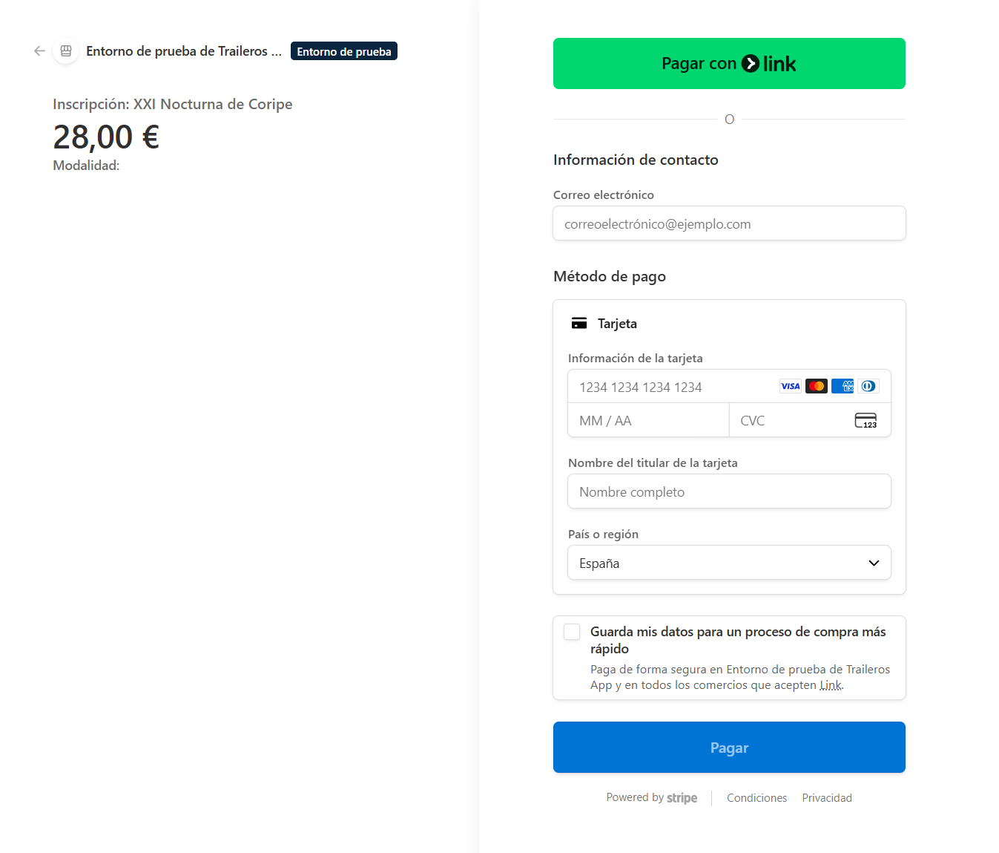
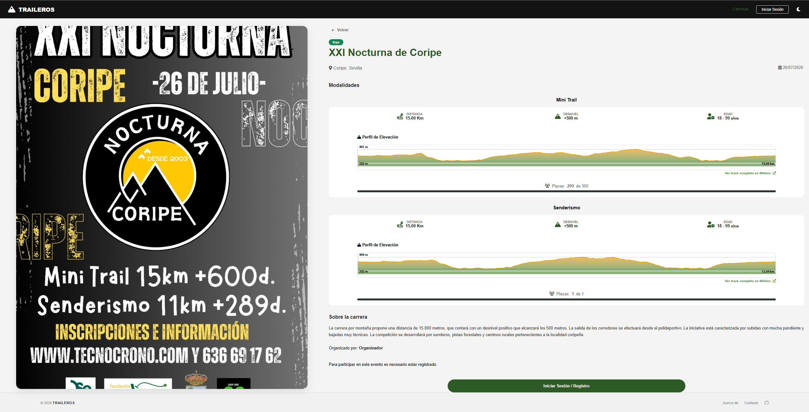

# 🏃‍♂️ Traileros - Gestión Integral de Carreras de Montaña


> **Acceso a la Demo en vivo:** [https://traileros.duckdns.org](https://traileros.duckdns.org)

**Traileros** es una plataforma web robusta diseñada para centralizar la gestión de eventos de Trail Running. Desde la creación de eventos por parte de organizadores hasta la inscripción y pago seguro de los corredores, Traileros ofrece una solución completa bajo una arquitectura MVC personalizada.

---

## 🚀 Características Principales

* **Arquitectura MVC Propia:** Desarrollada desde cero en PHP para un control total del flujo y la seguridad.
* **Gestión Multimodal:** Soporte para eventos con múltiples distancias (Trail, Ultra, Kilómetro Vertical, etc.).
* **Pasarela de Pagos Segura:** Integración completa con **Stripe API** para la gestión de inscripciones.
* **Altimetría Dinámica:** Visualización de perfiles de elevación mediante integración inteligente con **Wikiloc**.
* **Sistema de Roles:** 
    * 👤 **Corredor:** Gestión de perfil e historial de inscripciones.
    * 🏢 **Organizador:** Control total de sus eventos, modalidades y listados de inscritos.
    * 🛡️ **Admin:** Supervisión global y validación de nuevas solicitudes de organizador.
* **Resultados en Tiempo Real:** Publicación y consulta de tiempos y estados (Finisher, DNF, DNS).

---

## 🛠️ Stack Tecnológico

* **Backend:** PHP 8.2 (Vanilla MVC Architecture)
* **Base de Datos:** MySQL 8.0 / MariaDB
* **Frontend:** HTML5, SCSS (Custom design), JavaScript ES6+
* **Infraestructura:** AWS (EC2 para la App)
* **Herramientas:** Composer, PHPMailer, Stripe SDK

---

## 📂 Estructura del Proyecto

```text
traileros-mvc/
├── config/             # Configuración de DB, rutas y privilegios
├── controllers/        # Controladores (Auth, Evento, Inscripción, Usuario...)
├── database/           # Scripts SQL y migraciones
├── helpers/            # Funciones auxiliares (Validaciones, Sesiones)
├── libs/               # Núcleo del Framework MVC (App, Controller, Database, Model, View)
├── models/             # Modelos de datos (UserModel, EventoModel...)
├── public/             # Recursos accesibles públicamente
│   ├── css/            # Archivos SCSS/CSS compilados
│   ├── img/            # Imágenes del sistema y recursos estáticos
│   └── js/             # Scripts de cliente y validaciones
├── storage/            # Almacenamiento (Avatares, archivos temporales)
├── vendor/             # Dependencias de Composer (PHPMailer, Stripe SDK)
├── views/              # Plantillas de la interfaz
│   ├── admin/          # Paneles de administración
│   ├── layout/         # Cabeceras, pies de página y estructuras comunes
│   └── principal/      # Vistas públicas de la web
├── .htaccess           # Configuración de Apache (Friendly URLs)
├── composer.json       # Gestión de dependencias
├── index.php           # Punto de entrada único de la aplicación
└── readMe.md           # Documentación del proyecto

```

---

## 🖼️ Capturas de Pantalla (Showcase)

| Vista Principal | Proceso de Inscripción |
| :---: | :---: |
|  |  |
| *Landing page* | *Integración con la pasarela Stripe* |

| Detalles de carreras | Vista de Postpago |
| :---: | :---: |
|  |  |
| *Visualización de detalles, modalidades y plazas disponibles* | *Confirmación dinámica de inscripción* |